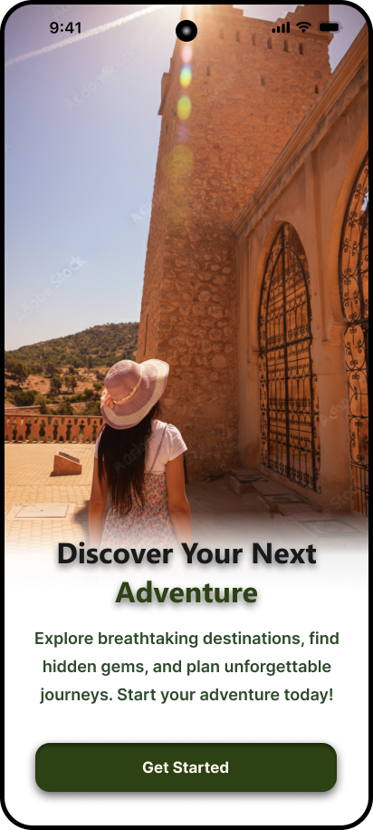
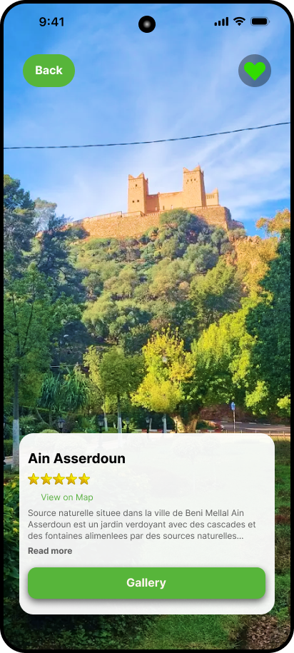
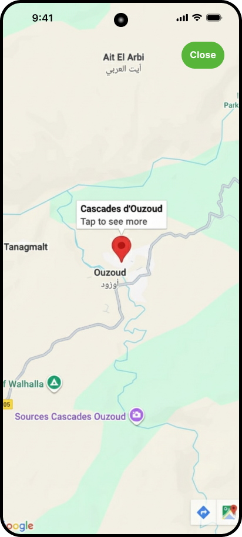
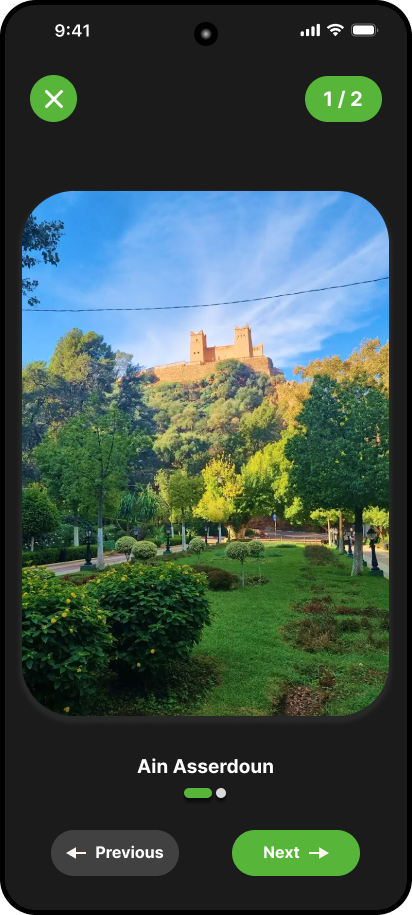

#  Beni Mellal Tourism App

A mobile app prototype built with React Native and Expo for exploring tourist attractions in Beni Mellal, Morocco. The app showcases beautiful locations with interactive features like maps, photo galleries, and favorites.

---

##  Project Overview

This project was built as a tourism app to help visitors discover the hidden gems of Beni Mellal. It features six main screens with smooth animations, swipeable galleries, and Google Maps integration. Built using React Native, Expo Router, and modern animation libraries.

---

##  Features

* Six screens (Home, City Details, Attractions List, Details, Map, Gallery)
* Navigation using Expo Router
* State management with Zustand
* Persistent favorites with AsyncStorage
* Swipeable photo gallery
* Interactive Google Maps integration
* Smooth animations using React Native Reanimated

---

## 🎯 What We Learned

* Building mobile apps with React Native and Expo
* File-based navigation with Expo Router
* Creating complex animations with React Native Reanimated
* Gesture handling with React Native Gesture Handler
* State management with Zustand
* Working with external APIs using Axios
* Integrating Google Maps into mobile apps
* Persisting data with AsyncStorage
* Team collaboration using GitHub

---

## 🛠️ Tech Stack

* React Native
* Expo
* Expo Router
* Zustand (state management)
* React Native Reanimated (animations)
* React Native Gesture Handler (swipe gestures)
* Axios (API calls)
* AsyncStorage (data persistence)
* react-native-maps (Google Maps)
* MockAPI (backend data)

---

## 📱 Screens

<div align="center">
  
  
  
</div>

<div align="center">
  
  
  
</div>

**Home Screen** - Welcome page with beautiful image and button

**City Details** - Information about Beni Mellal with location map

**Attractions List** - Scrollable cards showing all touristic spots

**Details screen** - Details for each attraction with a map button for location

**Map Modal** - Interactive Google Maps with markers


**Gallery Screen** - Swipeable photo gallery with animations

---

## 🚀 Getting Started

```bash
# Clone the repository
git clone https://github.com/medool421/beni-mellal-tourism.git
cd beni-mellal-tourism

# Install dependencies
npm install

# Start the app
npm run dev
```

Then press `a` for Android, `i` for iOS, or scan the QR code with Expo Go app.

---

## 👥 Team

* **Wissal Ouboujemaa** - Details Screen, Gallery Screen, Animations
* **Mohamed Oolahiane** - Home Screen, City Details, Attractions List

---

## 📄 License

This project is for learning and demonstration purposes. Feel free to use or modify it for your own projects.

---

